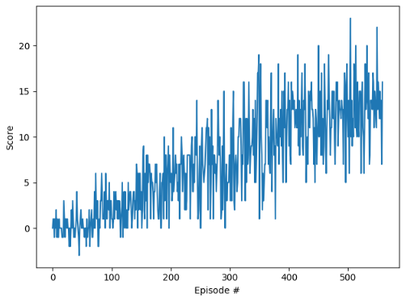

#### Learning Algorithms
**Deep Q-Learning**
```
Choose Reply Buffer Size N1, gamma, tau, batch_size, update_target_period, init step=0
create q_network, q_target_network
for i in episodes (0.....10000)
    init env and get the init state, step=0
    while not done:
        the agent choose a new action a_i
        the env generate reward , next_state and done(finish flag)
        save the (state action next_state reward done) into replay memory
        if replay memory size >  batch_size:
            sample a minibatch (send the data into deep neural network which contain two hidden layer with 512 units).
            get action from dnn
            calculate the loss by MSE(Q(state, action, theta) - reward - max_a Q(next_state, max_a, theta_fixed))^2
            backward the loss
        step+=1
    if step > update_target_period:
        update the target network
            
```

#### Results
*  **dqn_vec**

    ```
    Episode 100	Average Score: 0.76
    Episode 200	Average Score: 3.49
    Episode 300	Average Score: 6.43
    Episode 400	Average Score: 9.61
    Episode 500	Average Score: 12.18
    Episode 559	 Score: 16.00
    Environment solved in 459 episodes!	Average Score: 13.00
    ```
    


#### Future Ideas
* Implement Double DQN
* Implement Dueling DQN
* Using Prioritized Experience Replay
* Implement Rainbow